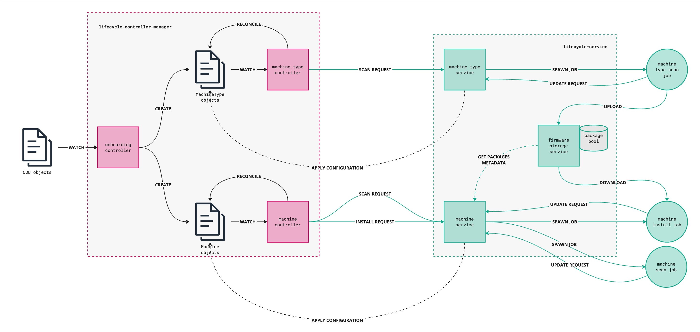
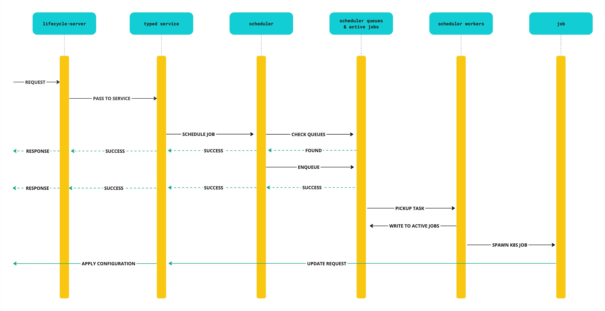

# lifecycle-manager

## Summary

The Lifecycle-Manager is a group of services, which purpose is to:

- discover available firmware updates for computes grouped by manufacturer and models;
- schedule periodic and on-demand scans of firmware currently installed on computes;
- schedule on-demand firmware installation;

It includes the following applications:

- `lifecycle-controller-manager` - Kubernetes operator, reconciles [Machine](#machine) and [MachineType](#machinetype) CRs;
- `lifecycle-service` - service, which schedules scans and firmware installation tasks;
- `lifecycle-storage` (**To-Be-Done**) - service to store firmware packages;
- `lcmctl` (**To-Be-Done**) - command-line tool to interact with `lifecycle-service`

## Architecture

### Overview

The architecture overview is provided in the figure in above. `lifecycle-controller-manager` includes three controllers:

- onboarding controller - watches for [OOB machine](https://github.com/ironcore-dev/oob/tree/main/api) objects and 
  creates corresponding [Machine](#machine) and [MachineType](#machinetype) objects;
- machine controller - reconciles [Machine](#machine) objects. Initiates scans for machine and might initiate 
  firmware installation considering state defined in object's spec;
- machinetype controller - reconciles [MachineType](#machinetype) objects. Initiates scans for certain machine type;

`lifecycle-service` includes the following services:

- RPC server, which can handle HTTP or gRPC requests;
- scheduler, which manage the task queue for on-demand scan or install jobs;
- storage interface (**To-Be-Done**), which provides capabilities to upload and download firmware packages;

### lifecycle-service request workflow

The workflow diagram is shown in the figure in above. 

## Custom Resources

### Machine

API reference: [lifecycle.ironcore.dev/v1alpha1.Machine](../api-reference/lifecycle.md/#lifecycle.ironcore.dev/v1alpha1.Machine)

The purposes of `Machine` type are: 

- to define the desired state of firmware installed on the compute node;
- to reflect the actual state of firmware installed on the compute node;

### MachineType

API reference: [lifecycle.ironcore.dev/v1alpha1.MachineType](../api-reference/lifecycle.md/#lifecycle.ironcore.dev/v1alpha1.MachineType)

The purposes of `MachineType` type are:

- to define the desired state if firmware installed on the group of compute nodes;
- to reflect the actual state of available firmware packages and their versions;
